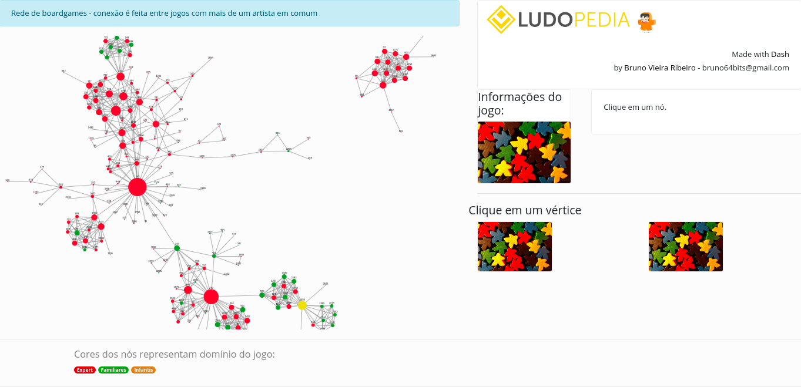
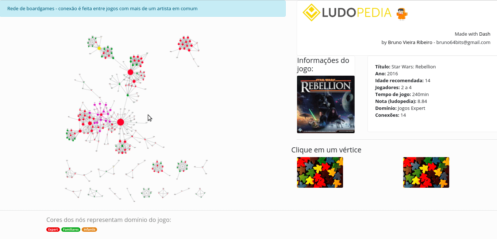

In this project we will go through our collected data from [Ludopedia](https://ludopedia.com.br/) ranking of boardgames. We'll perform basic data cleaning and EDA.

# Scraping

The data was collected using the [Scrapy](https://scrapy.org/) framework. The scraper is found inside the **scraper** folder. The relevant files in this folder are:
* `ludo/ludo/items.py`: defines the features we'll extract from the website.
* `ludo/ludo/spiders/ludospider.py`: defines the paths of each item of each game.

The final data set is pre-saved ins this repo under the name `ludo/ludo/all_pages2.csv`.

To run the scraper on local machine and save the data set under `your_output_name.csv`, access the top level directory (`ludo/`) and run `scrapy crawl ludo -O your_output_name.csv`. The option `-O` overwrites existing files.

# Data Cleaning

Notebook for cleaning: `projectLudo-Cleaning.ipynb`.

As I was interested in creating a graph visual using [Dash Cytoscape](https://dash.plotly.com/cytoscape), we will explore the relations between games by looking at the artists working in different games. Basically, we want to create a graph where each node corresponds to a game and the edges are drawn if the games share artists.

Columns in our dataset:
* 'age': recommended age to play the game
* 'artist': Names of artists that worked on the game (separated by commas)
* 'designer': Names of game designers (separated by commas)
* 'dominio': Domain of the game (Expert, Family or Child)
* 'imagem': URL to an image of the game cover
* 'mecanicas': List of mechanics involved in the game
* 'media': mean score given by users
* 'notaRank': score given by website (Bayesian average)
* 'notas': Amount of users giving score to game
* 'numOfPlayers': Number of players that can play the game
* 'position': Position in ranking
* 'timeOfPlay': Estimated time of single play through
* 'title': title of game
* 'year': year of release

This notebook focuses in cleaning the data and preparing information to create nodes and edges objects for the cytoscape graph. The folder `nodes` are populated within this notebook with:
* `artists-nodesfile.data`: information on each game that has, at least, one shared artist with another game, in the form of a pickle object with a list of dictionaries according to the **elements** variable required by [cytoscape](https://dash.plotly.com/cytoscape/elements).
* `PO-nodesfile.data`: same as the previous one, but only games having **more than one** shared artist with another game.

The folder `edges` is also populated within this notebook with:
* `artist-edgesfile.data`: information on the edge between games sharing at least one artist in the form of a pickle object with a list of dictionaries according to the **elements** variable required by [cytoscape](https://dash.plotly.com/cytoscape/elements).
* `artist-PO-edgesfile.data`: same as the previous one, but only games having **more than one** shared artist with another game.


The final cleaned data set is stored in the `cleaned` folder.

# EDA and Modeling

Notebook for EDA and modeling: `projectLudo-EDA-and-Modeling.ipynb`.

This notebook takes the cleaned data set and does basic EDA and creates a series of models to predict the domain (`dominio` column). This corresponds to a classification problem.

The model is very simplified as we consider as features only the 'age', 'timeOfPlay', 'minPlayers' and 'maxPlayers' columns and the 'dominio' column as target. For simplicity (and to avoid a huge imbalance) we group games in of of two possible target values:
* **Expert**: games that have the `Jogos Expert` domain value.
* **Casual**: games that have the `Jogos Familiares` OR `Jogos Infantis` domain value.

All models built are tree based and I focus on visualizing the evolution of the models and choice of hyperparameters. The final model is a RandomForestClassifier and is saved (using **joblib**) in the file `predict_domain.sav`.

# Dashboard

A [dash](https://dash.plotly.com/) app was created to explore connections between games that share artists.


*Dash app for games sharing more than one artist.*

Folder `dashboard` includes two files:
* `ludo-dash-v01.py`: Considers games sharing more than one artist and the graph layout is built using the `cose` option (based on [this](https://dl.acm.org/doi/10.1016/j.ins.2008.11.017) work).
* `ludo-dash-v02.py`: Considers games sharing at least of artist. As this creates a far denser graph, I used a `grid` layout. However, the layout option can be changed in line 75:
```
layout={'name': 'grid'}
```
Some of the options include: `preset` (user defined positions), `random`, `circle`, `concentric`, `breadthfirst` and `cose`.


*Example usage of dash app for the `ludo-dash-v01.py` script.*

**[Link](https://ludo-dash-app.herokuapp.com/) to deployed app.**
